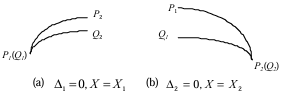
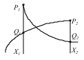
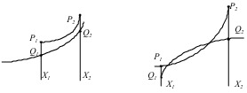

## 算法原理

### 一、参考文献

本程序基于《图形系统中实用椭圆求交快速算法的研究和实现》论文编写，使用该论文中阐述的方法对交点坐标进行求解。

### 二、算法原理

#### 2.1 问题概述

椭圆在直角坐标系中的一般方程可表示为$$Ax^2+By^2+Cxy+Dx+Ey+F=0$$，将两个椭圆的一般方程联立可表示为如下形式
$$
\left\{\begin{matrix}
A_1x^2+B_1y^2+C_1xy+D_1x+E_1y+F_1=0 \\
A_2x^2+B_2y^2+C_2xy+D_2x+E_2y+F_2=0
\end{matrix}\right.
$$
上面的方程组可能会有一个、两个、三个、四个或没有解。如果利用数值分析的方法进行求解，迭代的初始条件会很难确定，并且在计算机中实现也会存在困难。所以需要一种更为简单快速的方法在计算机中实现两椭圆交点的求解。

#### 2.2 获取椭圆在直角坐标系中的一般方程

由于在实际应用中，椭圆直角坐标系一般方程中的$$A,B,C,D,E,F$$六个参数很难直接获得，而椭圆的圆心坐标、长轴长、短轴长、长轴与x轴的夹角则较为容易获得，所以一般在构造椭圆时常采用极坐标表示，具体方程如下
$$
\frac{((x-x_0)\cos\alpha+(y-y_0)\sin\alpha)^2}{a^2}+\frac{((x-x_0)\sin\alpha-(y-y_0)\cos\alpha)^2}{b^2}=1
$$
其中$$(x_0,y_0)$$为椭圆的圆心坐标，$$a$$为椭圆长轴长的一半，$$b$$为椭圆短轴长的一半，$$\alpha$$为椭圆长轴与x轴的夹角。

需要一种方法将椭圆在极坐标下的一般方程转化为直角坐标系下的一般方程。

首先考虑圆心在坐标原点的椭圆，即$$\frac{(x\cos\alpha+y\sin\alpha)^2}{a^2}+\frac{(x\sin\alpha-y\cos\alpha)^2}{b^2}=1$$。将该方程展开整理后可得到如下形式
$$
(\frac{\cos^2\alpha}{a^2}+\frac{\sin^2\alpha}{b^2})x^2+(\frac{\sin^2\alpha}{a^2}+\frac{\cos^2\alpha}{b^2})y^2+2\cos\alpha\sin\alpha(\frac{1}{a^2}-\frac{1}{b^2})xy=1
$$
该方程的形式为$$Ax^2+By^2+Cxy=1$$，其中$$A,B$$均大于0。向其中加入椭圆圆心坐标$$(x_0,y_0)$$将方程转化为如下形式
$$
A(x-x_0)^2+B(y-y_0)^2+C(x-x_0)(y-y_0)=1
$$
展开后可以得到如下形式
$$
Ax^2+By^2+Cxy-(2Ax_0+Cy_0)x-(2By_0+Cx_0)y+(Ax_0^2+By_0^2+Cx_0y_0-1)=0
$$
即获得了椭圆在直角坐标系下的一般方程，其中
$$
\left\{\begin{matrix}
A=\frac{\cos^2\alpha}{a^2}+\frac{\sin^2\alpha}{b^2} \\
B=\frac{\sin^2\alpha}{a^2}+\frac{\cos^2\alpha}{b^2} \\
C=2\cos\alpha\sin\alpha(\frac{1}{a^2}-\frac{1}{b^2}) \\
D=-(2Ax_0+Cy_0) \\
E=-(2By_0+Cx_0) \\
F=Ax_0^2+By_0^2+Cx_0y_0-1
\end{matrix}\right.
$$

#### 2.3 计算椭圆的四个极值点

通过椭圆的四个极值点可以将椭圆分为四段单调弧。对于单调弧之间相交问题的求解会比直接对椭圆相交求解更简单。

对椭圆的一般方程$$Ax^2+By^2+Cxy+Dx+Ey+F=0$$进行隐函数求导可以得到$$y$$对于$$x$$导数的关系如下
$$
\frac{dy}{dx}=\frac{-2Ax-Cy-D}{Cx+2By+E}
$$

##### 2.3.1 上下极值点

令$$\frac{dy}{dx}=0$$，即$$-2Ax-Cy-D=0$$，可得到$$y$$与$$x$$的函数关系$$y=-\frac{2Ax+D}{C}$$，上下极值点就在这个函数表示的直线上。将该函数代入椭圆一般方程中可得到如下形式
$$
Ax^2+B\cdot\frac{(2Ax+D)^2}{C^2}-x(2Ax+D)+Dx-\frac{(2Ax+D)E}{C}+F=0
$$
展开并化简后可得到如下的一元二次方程
$$
(4A^2B-AC^2)x^2+(4ABD-2ACE)x+(BD^2-CDE+C^2F)=0
$$
该方程可以利用求根公式快速求解。由于椭圆必定存在上下极值点，所以该方程必定有实数解。如果椭圆长轴与x轴夹角为0°或90°，该方程有两个相同的实数解。其余情况下，该方程有两个不同的实数解。

对于有两个不同的解的情况，将计算得到的$$x$$代入函数$$y=-\frac{2Ax+D}{C}$$中即可得到两个极值点坐标。

对于有两个相同的解的情况，此时椭圆一般方程中的$$C$$为0，方程可简化为$$Ax^2+By^2+Dx+Ey+F=0$$。将$$x$$视为已知量可以求出$$y$$关于$$x$$的表达式如下
$$
y=\pm\sqrt{\frac{-4ABx^2-4BDx-4BF+E^2}{4B^2}}-\frac{E}{2B}
$$
利用该表达式可以求出两个极值点的坐标。

##### 2.3.2 左右极值点

令$$\frac{dy}{dx}=\infty$$，即$$Cx+2By+E=0$$，可得到$$y$$与$$x$$的函数关系$$y=\frac{Cx+E}{2B}$$，左右极值点就在这个函数表示的直线上。将函数代入椭圆一般方程中可得到如下形式
$$
Ax^2+B\cdot\frac{(Cx+E)^2}{4B^2}-Cx\cdot\frac{Cx+E}{2B}+Dx-E\cdot\frac{Cx+E}{2B}+F=0
$$
展开并化简后可得到如下的一元二次方程
$$
(4AB-C^2)x^2+(4BD-2CE)x+(4BF-E^2)=0
$$
该方程可以利用求根公式快速求解。由于椭圆必定存在左右极值点，且左右极值点的横坐标必定不同，所以该方程必定有两个不相同的实数解。

将计算得到的$$x$$代入函数$$y=\frac{Cx+E}{2B}$$中即可得到两个极值点的坐标。

#### 2.4 排除显然不相交的单调弧

通过四个极值点可以将两个椭圆分别分成4个单调弧，将其两两组合可以得到共16个单调弧对。对于每一个单调弧，根据其起始点和终点坐标可以划出一个包含其的最小水平矩形。对于每一个单调弧对，根据其中的两个单调弧对应的矩阵是否相交来排除显然不相交的单调弧，以省去后去计算的时间。

剩余的单调弧对的交点数目可能有零个、一个或两个。对于每一个单调弧对中的两段单调弧，分别将其设为$$P,Q$$。在同一$$X$$坐标$$X_i$$下对应的$$Y$$坐标分别设为$$f(P_i)$$和$$f(Q_i)$$。定义$$\Delta_i=f(P_i)-f(Q_i)$$，$$\mathbf{X}=\Delta_j\times\Delta_k$$。两弧的$$X$$坐标范围的交集设为$$[X_1,X_2]$$，其中$$X_1,X_2$$分别表示坐标交集的最小值和最大值。两单调弧若存在交点，则交点必定在该范围内。

#### 2.5 $$\Delta_1=0$$或$$\Delta_2=0$$（两单调弧端点相交）

若$$\Delta_1=0$$，则两单调弧在$$X$$坐标为$$X_1$$处相交；若$$\Delta_2=0$$，则两单调弧在$$X$$坐标为$$X_2$$处相交。如图所示

#### 2.6 $$\mathbf{X}<0$$（两单调弧有且仅有一个交点）

若$$\mathbf{X}<0$$，根据单调曲线的性质，两单调弧有且仅有一个交点，如图所示

这种情况下，可以通过二分法进行求解，具体步骤如下

1. 计算$$X_k=\frac{X_1+X_2}{2}$$
2. 计算$$\Delta_k=f(P_k)-f(Q_k)$$
3. 若$$\Delta_k=0$$，则跳到第7步
4. 若$$\Delta_1\times\Delta_2<0$$，则跳到第6步
5. 令$$X_1=X_k,\Delta_1=\Delta_k$$，跳到第1步
6. 令$$X_2=X_k,\Delta_2=\Delta_k$$，跳到第1步
7. $$(X_k,f(P_k))$$即为所求交点

#### 2.7 $$\mathbf{X}>0$$（两单调弧有两个或没有交点）

若$$\mathbf{X}>0$$，两单调弧可能有两个、一个或没有交点，如图所示

以$$X$$坐标增大方向为正方向，确定两椭圆弧上每一点的的切矢方向，分别设为$$a$$（曲线P）和$$b$$（曲线Q），其均在$$[-90°,90°]$$。根据单调曲线和椭圆的性质，切矢与$$X$$轴正方向夹角的变化也是单调的。

##### 2.7.1 $$(a_1-b_1)\times(a_2-b_2)>0$$（两单调弧没有交点）

若$$(a_1-b_1)\times(a_2-b_2)>0$$，根据单调曲线和椭圆的性质，两单调弧没有交点。

##### 2.7.2 $$(a_1-b_1)\times(a_2-b_2)<0$$（两单调弧有两个、一个或没有交点）

若$$(a_1-b_1)\times(a_2-b_2)<0$$，两单调弧有两个、一个或没有交点。这种情况下，按照下述步骤对交点进行求解

1. 使用跟2.6节中类似的二分法找到两单调弧上切矢方向相同的点
2. 将该处的$$X$$轴坐标设为$$X_k$$，并计算$$\Delta_k$$
3. 若$$\Delta_k=0$$，则两单调弧有且仅有一个交点，交点坐标为$$(X_k,f(P_k))$$
4. 若$$\Delta_1\times\Delta_k>0$$，则必有$$\Delta_k\times\Delta_2>0$$，此时两单调弧没有交点
5. 若$$\Delta_1\times\Delta_k<0$$，则必有$$\Delta_k\times\Delta_2<0$$，此时两单调弧有两个交点，且两交点的$$X$$分布于$$X_k$$两侧
6. 将以$$X_k$$为分隔的两组单调弧对分别按照2.6节的方法求出交点